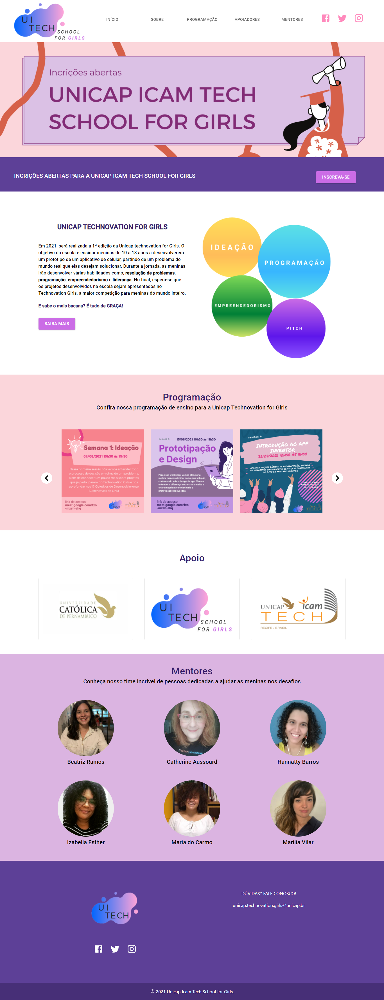
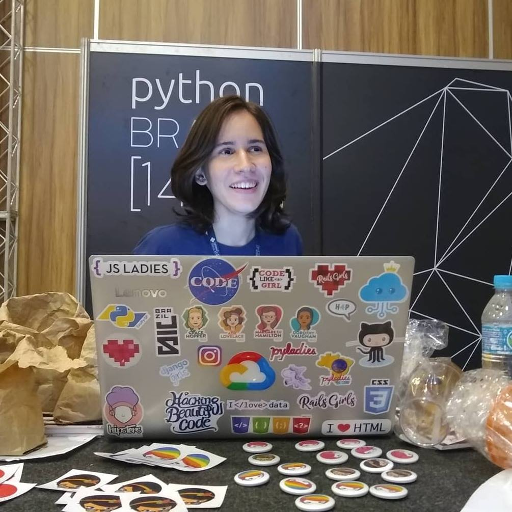

# Unicap Icam Tech for Girls
<h1 align="center">
    

</h1>

  <a href="#sobre">Sobre </a>|
  <a href="#tecnologias">Tecnologias </a>|
  <a href="#projeto">Projeto </a>|
    <a href="#link-projeto">Link do projeto </a>|
  <a href="#desenvolvimento">Desenvolvimento</a>

 
 

## Sobre

    O objetivo da Unicap Icam Tech School for Girls é ensinar meninas de 10 a 18 anos a desenvolverem um protótipo de um aplicativo de celular, partindo de um problema do mundo real que elas desejam solucionar. Durante a jornada, as meninas irão desenvolver várias habilidades como, resolução de problemas, programação, empreendedorismo e liderança. No final, espera-se que os projetos desenvolvidos na escola sejam apresentados no <a href="https://technovationchallenge.org/" target="_blank">Technovation Girls</a> , a maior competição para meninas do mundo inteiro.

 
 

## Tecnologias Utilizadas
 

Este projeto foi desenvolvido com as seguintes tecnologias:

 
<ul>
  <li><a href="https://developer.mozilla.org/pt-BR/docs/Aprender/JavaScript" target="_blank">JavaScript</a></li>
  <li><a href="https://reactjs.org/" target="_blank">ReactJs</a></li>
  <li><a href="https://material-ui.com/pt/" target="_blank">Material-UI</a></li>
</ul>
 
 

## Projeto
 

O projeto consiste em uma aplicação one-page para a apresentação do projeto Unicap Icam Tech School for Girls.

No cabeçalho podemos encontrar a logo do projeto, um menu navegação e as redes sociais. A aplicação está divida em seções. A seção Sobre, é possível buscar mais informações sobre a escola e sobre a competição Technovation Girls. Logo abaixo uma seção onde é possível conferir toda a programação de ensino da escola Unicap Icam Tech School for Girls. Na seção de Apoio podemos visualizar os apoiadores do projeto, e na seção seguinte é possível identificar o time de mentores que irão ajudar as meninas nos desafios. Por fim no rodapé temos novamente a logo, as redes sociais do projeto e um e-mail para contato.

 
 

<a lign="center" href="https://www.figma.com/file/9dwDjRPxemTBSxDrBcV0LN/Unicap-Icam-Tech-School-for-Girls?node-id=0%3A1" target="_blank">🎨  Clicando aqui </a> é possível verificar o layout do projeto, desenvolvido no Figma

 
<h3 align="center">
    
</h3>
 
 

## Link para o projeto
 

Atualmente, o projeto encontra-se hospedado no <a href="https://www.heroku.com/" target="_blank">Heroku</a> Uma plataforma em nuvem para hospedagem, implantação, escalonamento e garenciamento de aplicativos.

 

Link da aplicação: <a href="https://unicap-icam-tech-school-girls.herokuapp.com/" target="_blank">Unicap Icam Tech School for Girls</a>

 
 

## Desenvolvimento
 
 
 
<table>
  <tr>
        <td align="center" style="border: none;">
            <a href="https://github.com/debcamila">
                
                 
                <b>Deborah Camila</b>
            </a>
             
            
<scan title="Code">💻</scan>|<scan title="Documentation">🎨</scan>|<scan title="Bugs">🐛</scan>

        </td>
    </tr>
</table>